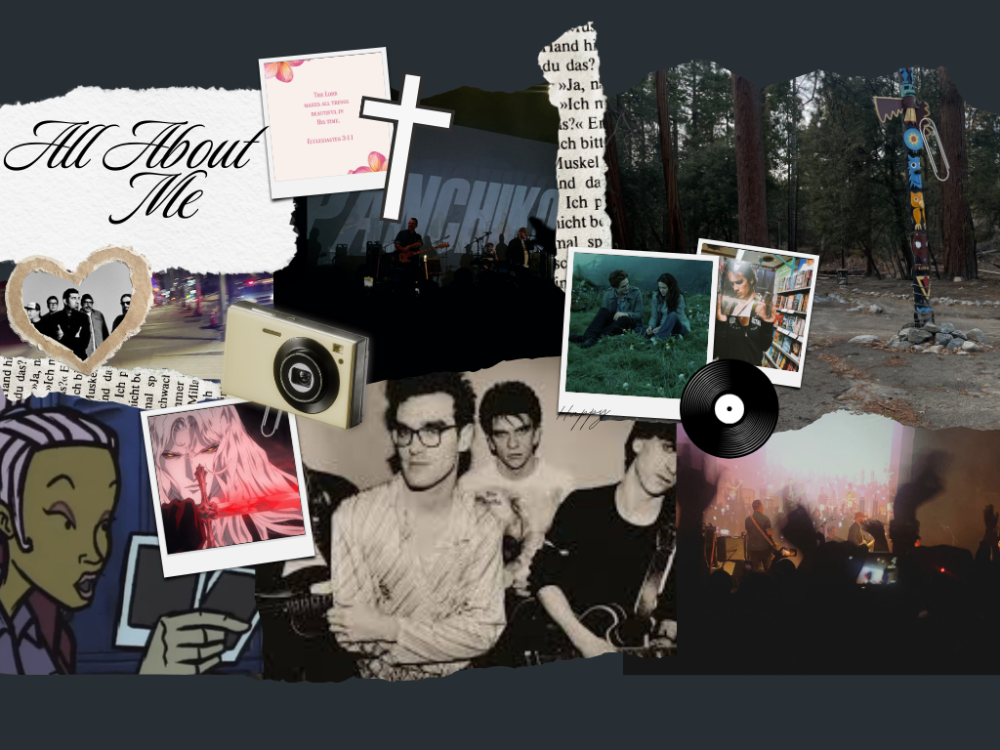

# me-in-markdown

# Introduction

Hello this is my intro! My name is Alexis and I am in 10th grade. I play volleyball. I love music and I've played piano ever since I was 3. My favorite movie is La La Land. My favorite book is One of us is Lying. My favorite food is in n out burgers. Some personal achievements that I have are making JV volleyball and getting most improved in swim 2 years in a row. A fun fact about me is that I write poems and songs. I never produced any though.

My goals for this year are to maintain good grades and stay on top of homework and schoolwork. I would also like to stay focused in class and join clubs and be active in them. I want to make new friends and get to know my teachers. 

All my life, I've done sports. The first sport I've done was gymnastics. I did that for about 5 years. While I did gymnastics, I also did karate for 3 years. I also was in ballet and hiphop classes for 2 years.  When I got to 5th-6th grade, I did competitive swimming. In 5th and 6th grade I did softball and track. Lastly, I've done volleyball for 7 years now.

# My Playlist
[This is my playlist](https://open.spotify.com/playlist/5nbgJBII78lTTTfCiVamH0?si=Y4OAR_7LRZCbv4bsnOMCSw)
# College/Moodboard

